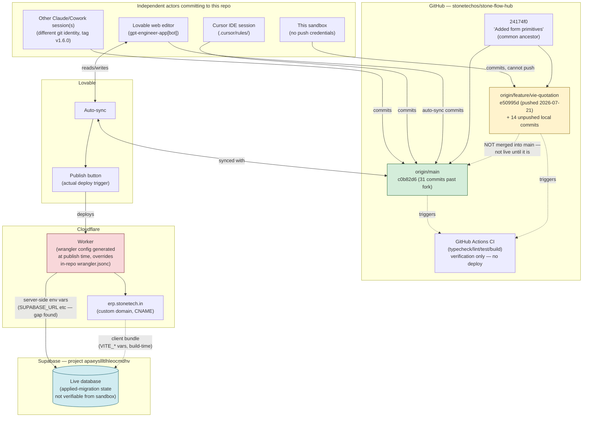

# Sprint 1.8 — Platform Stabilization Audit

**Status:** Investigation only. No code was changed to produce this report.
**Scope:** Git, Supabase, Cloudflare, Lovable — determine the actual source of truth across all four platforms.
**Date:** 2026-07-23

---

## 0. Executive summary

The four platforms are **not synchronized**, and the split is structural, not cosmetic:

- **GitHub has two independent lineages.** `origin/main` and `origin/feature/vie-quotation` share a common ancestor (`24174f0`, "Added form primitives") but have not been merged in either direction since. `origin/main` has received 31 commits from other actors (Lovable's auto-sync bot, at least one other Claude/Cowork session, evidence of a Cursor IDE session) that never touched `feature/vie-quotation`. This sandbox's branch has 8 commits `main` doesn't have.
- **This sandbox's branch was previously pushed successfully.** `origin/feature/vie-quotation` exists on GitHub at `e50995d` ("Apply ESLint auto-fixes", 2026-07-21) and is a clean ancestor of local HEAD (`f8665e1`) — local is a fast-forward 14 commits ahead, no divergence on that branch specifically. The earlier working assumption in this engagement — "no push access, ever" — is only true *for this current sandbox session*; a prior session/sandbox did push. (This session still cannot push: no GitHub credentials are configured here.)
- **Lovable is the actual deploy trigger**, and it syncs to `origin/main`, not to `feature/vie-quotation`. That means everything built in this multi-sprint engagement (Sprint 1.7 through AI-1.6) is **not live** on `erp.stonetech.in` unless someone merges `feature/vie-quotation` into `main` and republishes.
- **The Supabase "missing environment variable" production bug is a Lovable Cloud secrets-configuration issue**, not a code defect — confirmed again in this audit (see §2).
- **Database migrations diverge in both directions** between the two branches, against a single shared Supabase project. Which migrations are actually applied to the live database cannot be determined from this sandbox.

**Recommendation (§5): GitHub `main`, updated via a reviewed merge of `feature/vie-quotation`, should become the single source of truth**, with Lovable's auto-sync and this branch's future work both flowing through it. Detail and rationale below.

---

## 1. Git

### 1.1 Current state (this sandbox)

| | |
|---|---|
| Current branch | `feature/vie-quotation` |
| HEAD | `f8665e1` — "Sprint AI-1.6: generic Entity Resolution Framework" (2026-07-22 19:56 UTC) |
| Working tree | clean |
| Remote | `origin` → `https://github.com/stonetechos/stone-flow-hub.git` (single remote, fetch = push URL) |

### 1.2 Branches

- `feature/vie-quotation` (local + `origin/feature/vie-quotation` exists on GitHub)
- `main` (local, tracking `origin/main`) — **not checked out**, 31 commits behind `origin/main` in the local copy (this is just a stale local ref; `origin/main` itself is current as of the last fetch).
- No other local or detached branches.

### 1.3 Unpublished / unpushed work

Two different pushed states exist for `feature/vie-quotation`:

- **On GitHub (`origin/feature/vie-quotation`):** `e50995d` "Apply ESLint auto-fixes" — pushed 2026-07-21.
- **Local HEAD:** `f8665e1`, **14 commits ahead** of `origin/feature/vie-quotation`, and `origin/feature/vie-quotation` is a clean ancestor (fast-forward, no conflicts on this branch). Those 14 commits are this engagement's Sprint 1.7 → AI-1.6 work:

  ```
  f8665e1  Sprint AI-1.6: generic Entity Resolution Framework
  6843dab  Sprint AI-1.5: structured Planner blockers & UI rendering
  b45ecc7  Sprint AI-1: wire Copilot chat panel to VIE
  dfc45b1  Add AI Copilot v2 architecture blueprint
  169a159  Sprint 1.8: MasterListPage standardization
  db54d28  Sprint 1.7.1: Platform Hardening & Architecture Corrections
  547dc02  Sprint 1.7: Authentication Foundation, Super Admin architecture, platform branding
  7845a4b  Bring create_quotation Milestones 2-6 into version control
  24174f0  Added form primitives
  6e618d2 / 109a44e / c6846fc / db41697 / 1007965  (earlier WIP commits)
  ```

  **This sandbox cannot push** ("could not read Username for 'https://github.com': terminal prompts disabled" — no credentials configured here). Read access (`fetch`) works fine. This is a sandbox-local limitation, not evidence that push access doesn't exist for the project generally — a prior session clearly had it.

### 1.4 Merge status vs. `origin/main`

```
merge-base(feature/vie-quotation, origin/main) = 24174f0  "Added form primitives"
feature/vie-quotation is 8 commits ahead of that merge-base
origin/main            is 31 commits ahead of that merge-base
Neither branch is an ancestor of the other. This is a real fork, not a fast-forward gap.
```

The 8 branch-only commits are exactly the last 8 of the 14 listed in §1.3 (`7845a4b` through `f8665e1` — i.e. everything after `24174f0`). The `origin/main`-only 31 commits include, notably:

- `gpt-engineer-app[bot]` auto-commits — confirms Lovable's web editor pushes directly to `main` on every save.
- At least one commit from a different "Claude (Cowork)" git identity than this session's (`Claude <noreply@anthropic.com>`), tagged `v1.6.0` — evidence of a separate Cowork session having worked directly against `main`.
- A `.cursor/rules/` file — evidence of a Cursor IDE session also touching this repo.
- An `import/vie-foundation` PR merge containing a commit **byte-identical** to this branch's own `7845a4b` ("Bring create_quotation Milestones 2-6 into version control") — i.e. the same work was independently applied to both lineages via two different paths.
- Commit `c0b82d6` ("STOS" rebrand) and commit `44c7587` ("AI foundation integration") — both touch files this engagement also modified.

**Two concrete merge-conflict risks**, files edited on both lineages since the fork point:

| File | Touched on `origin/main` by | Touched on `feature/vie-quotation` by |
|---|---|---|
| `src/components/layout/AppShell.tsx` | `c0b82d6` (STOS rebrand) | Sprint 1.8 branding work |
| `src/components/copilot/Copilot.tsx` | `44c7587` (AI foundation integration) | Sprint AI-1 (Copilot↔VIE wiring) |

`44c7587` on `origin/main` also touches `src/routes/_authenticated/admin/users.tsx` — the same admin page the user reported the Supabase env-var error on. Whether that commit is related to the root cause is not established here; it's flagged as worth a diff review before any merge, not concluded.

### 1.5 Tags

```
v1.6.0                  (on origin/main lineage — another session's tag)
vie-foundation-complete
ci-green-2026-07-21
vie-m2-complete
vie-phase2-m1
vie-phase1-stable
```

`v1.6.0` living on the `main` lineage while this branch has done independent "AI-1.6" work under the same version-ish name is a naming collision worth the team's attention — not a git problem, a communication one.

---

## 2. Supabase

### 2.1 Project connection

Single project, referenced consistently everywhere it appears:

- `supabase/config.toml` → `project_id = "apaeysllltlhleocmdhv"`
- `.lovable/mcp/manifest.json` → same project ID in its OAuth issuer URL

No evidence of multi-project confusion. Both git lineages point at the same live database — which is exactly what makes the migration divergence (below) a real risk rather than a non-issue.

### 2.2 Environment variables — client vs. server split

Confirmed by reading all three Supabase integration files (all marked "This file is automatically generated. Do not edit it directly." — Lovable-owned):

| Var | Read by | Where | Baked in at |
|---|---|---|---|
| `VITE_SUPABASE_URL` / `VITE_SUPABASE_PUBLISHABLE_KEY` | `client.ts` (browser client) | `import.meta.env` | Vite build time |
| `SUPABASE_URL` / `SUPABASE_PUBLISHABLE_KEY` | `client.ts` (SSR fallback), `auth-middleware.ts` (`requireSupabaseAuth`) | `process.env` | Request time, in the deployed Worker |
| `SUPABASE_URL` / `SUPABASE_SERVICE_ROLE_KEY` | `client.server.ts` (`supabaseAdmin`) | `process.env` | Request time, in the deployed Worker |

`src/lib/env/config-status.ts` is the single source of truth for "is Supabase configured" (Sprint 1.7, Part 1) — computed once, cached, consumed by the root route's configuration gate and by `client.ts`'s defense-in-depth throw. It checks the same var pair the browser client does, **not** the server-only pair `auth-middleware.ts` checks.

**This is the exact mechanism behind the production bug the user reported.** The root-route gate passes (client-side `VITE_*` vars are present — the page renders, the UI is visible), but `requireSupabaseAuth` — which gates virtually every admin `createServerFn`, including all of `listAuthUsers` / `inviteUser` / `createUserWithPassword` in `src/lib/admin/users.functions.ts` — fails at request time because the plain-named server vars (`SUPABASE_URL`, `SUPABASE_PUBLISHABLE_KEY`) aren't set in the deployed Cloudflare Worker's environment. This reproduces exactly what the screenshots showed: page loads, "Add user" fails with "Missing Supabase environment variable(s)." This is a **Lovable Cloud → Cloudflare secrets propagation gap, not an application bug** — confirmed again in this audit, consistent with the earlier investigation.

### 2.3 Service-role (`supabaseAdmin`) usage inventory

Full repo scan for importers of `client.server.ts`:

- `src/lib/admin/users.functions.ts` — admin user management (expected: needs to bypass RLS to manage `auth.users`)
- `src/routes/api/public/hooks/customer-payment-reminders.ts` — public webhook handler
- `src/routes/api/public/hooks/whatsapp.ts` — public webhook handler
- `src/routes/api/public/webhooks/razorpay.ts` — public webhook handler

All four are legitimate: admin operations and unauthenticated inbound webhooks are exactly the cases that need to bypass RLS. No stray or unexpected service-role usage found elsewhere in the codebase.

### 2.4 RLS coverage

Static scan across all 95 migration files: every `CREATE TABLE` name found has a matching `ALTER TABLE ... ENABLE ROW LEVEL SECURITY` somewhere in the migration history (128/128 matched by name). This is a regex-based heuristic over migration SQL, not a live schema query — it can't see the database's actual current state, and it would miss a table that had RLS enabled and later disabled, or a table created and RLS'd in a Lovable-only migration this sandbox doesn't have. Treat as "no obvious static gap," not as a live-verified guarantee.

### 2.5 Migration divergence between the two git lineages

```
Migrations only on origin/main:            1  (an RLS policy fix)
Migrations only on feature/vie-quotation:  6  (Sprint 1.7 / 1.7.1 — Super Admin role,
                                               bootstrap, protection, audit columns)
```

Both branches target the same live project ID. **Which of these migrations have actually been applied to the live database cannot be determined from this sandbox** — there are no Supabase credentials or CLI configured here (`env | grep -i supabase` is empty, no `supabase` CLI installed). This is the single largest unresolved risk in this audit: if `main`'s branch was published via Lovable more recently than this sandbox's migrations were applied, or vice versa, the live schema may not match either branch's migration folder exactly.

### 2.6 Not inspectable from this sandbox (dashboard-only)

Auth provider configuration, HIBP/leaked-password protection, email verification settings, and the live database's actually-applied migration state all live in the Supabase dashboard / require live credentials this sandbox doesn't have. These need a direct dashboard check, not a code audit.

---

## 3. Cloudflare

### 3.1 Deployment target: Workers, not Pages

Confirmed from three independent sources:

- `docs/DEPLOYMENT.md`: "Cloudflare Workers (nodejs_compat) — served via Lovable hosting."
- `vite.config.ts` comment: "nitro (build-only using cloudflare as a default target)" — the Lovable-provided `@lovable.dev/vite-tanstack-config` wrapper defaults Nitro's build target to Cloudflare.
- `wrangler.jsonc` shape (`main: ".output/server/index.mjs"`, `assets.directory: ".output/public"`) is a Workers-with-static-assets config, not a Pages project config.

No `_routes.json`, no Pages-specific config anywhere in the repo. This project uses **Cloudflare Workers exclusively** — "Pages configuration" (as asked in the sprint spec) does not apply; there isn't one.

### 3.2 `wrangler.jsonc` (in-repo)

```json
{
  "name": "stone-flow-hub",
  "main": ".output/server/index.mjs",
  "compatibility_date": "2026-07-16",
  "assets": { "directory": ".output/public" }
}
```

No `vars`, `secrets`, or bindings declared here — this file is minimal and is **overridden at publish time** by Lovable's own generated `.output/server/wrangler.json` (confirmed previously by a Lovable build log line: `[nitro] WARN [cloudflare] Wrangler config main is overridden...`). The in-repo file is not the operative config for what actually gets deployed.

### 3.3 Environment variables / secrets

Not inspectable from this sandbox — live Worker secrets are configured through Lovable Cloud / the Cloudflare dashboard, not through any file in this repo. The env-var gap identified in §2.2 lives here: someone needs to confirm, in the Cloudflare Worker's actual environment (via Lovable's publish pipeline), that `SUPABASE_URL`, `SUPABASE_PUBLISHABLE_KEY`, and `SUPABASE_SERVICE_ROLE_KEY` are set as server secrets, separately from the `VITE_*` build-time vars.

### 3.4 Production vs. preview build

`docs/DEPLOYMENT.md` documents a Preview / Production / custom-domain (`erp.stonetech.in`, via CNAME) environment table, and Lovable's "Publish" button as the deploy trigger, with rollback via "Backend → Deployments → previous build → Rollback." GitHub Actions (`.github/workflows/ci.yml`) runs typecheck/lint/test/build on push to `main` and on PRs but has **no deploy step** — it is verification-only. It does not gate or trigger what Lovable publishes.

---

## 4. Lovable

### 4.1 What's confirmed

- Lovable's web editor auto-syncs directly to `origin/main` (`gpt-engineer-app[bot]` commits are visible in `main`'s history).
- Lovable's "Publish" button is the actual deploy trigger to Cloudflare, per `docs/DEPLOYMENT.md` — deployment is decoupled from GitHub Actions entirely.
- `.lovable/project.json` and `.lovable/mcp/manifest.json` are tracked in git on both lineages and reference the same Supabase project, so there's no project-identity ambiguity there.

### 4.2 What's not verifiable from this sandbox

Whether Lovable's **current live editor state** is fully captured in the latest fetched `origin/main` HEAD, or whether further edits exist in Lovable that haven't synced to GitHub yet, cannot be determined here — this sandbox only has read access to GitHub, not to Lovable's own project history/sync log. **This needs a direct check in the Lovable dashboard** (project history / sync status) by someone with access, before treating `origin/main` as a complete picture of "what Lovable has."

---

## 5. Source of truth recommendation

**GitHub `main` should be the permanent source of truth**, for a structural reason: it's the only one of the four platforms with (a) a full commit history, (b) branch/PR-based review capability, and (c) something else — Lovable's auto-sync and this engagement's own branch — both already converging toward it. Cloudflare has no independent history (it just deploys whatever it's told to), and Lovable's own history isn't inspectable outside its dashboard.

For that to actually be true rather than aspirational, three things need to happen, in this order, **none of which this audit performed**:

1. **Someone with push access reviews and merges `feature/vie-quotation` into `main`**, resolving the two flagged file conflicts (`AppShell.tsx`, `Copilot.tsx`) by hand, and reconciling the two commits both lineages independently contain (`7845a4b`, already byte-identical on both sides — should merge cleanly as a no-op).
2. **The migration divergence gets reconciled against the live database's actual state** — this requires Supabase dashboard/CLI access this sandbox doesn't have, to confirm which of the 7 divergent migrations (1 main-only, 6 branch-only) are actually applied live before assuming either branch's migration folder is authoritative.
3. **Lovable's sync target and this branch's future work both point at the same place going forward** — i.e. after the merge, either stop working directly on `feature/vie-quotation` in isolation, or treat it as a short-lived integration branch that merges to `main` promptly and often, so Lovable's auto-sync and this engagement's commits stop drifting apart for weeks at a time.

Until step 1 happens, **none of Sprint 1.7 through AI-1.6's work is live** — it exists only on `feature/vie-quotation`, which Lovable does not publish from.

---

## 6. Dependency diagram



---

## 7. What this audit did not do

Per the sprint instruction, no code was changed, no merge or rebase was performed, and no migration reconciliation was attempted. This is diagnosis only. The three action items in §5 are the recommended next steps, in order, and should each be scoped as their own sprint before execution.
