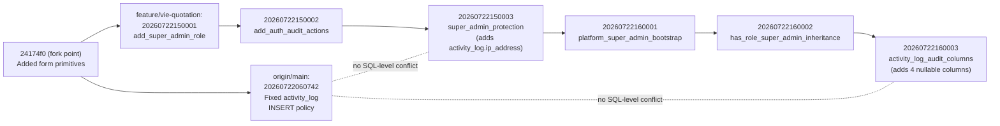

# Sprint 2.4 — Final Infrastructure & Production Validation

**Date:** 2026-07-23
**Branch:** `feature/vie-quotation`
**Objective:** validate what Sprints 2.2/2.3 could not — everything
*outside* the repository. Per the sprint's own rule, every finding below
is tagged **Verified** (checked directly, evidence attached), **Inferred**
(a reasoned conclusion from code/config/docs, not independently confirmed
against live state), or **Cannot verify from sandbox** (requires a live
dashboard, account, or network path this environment does not have).
No feature work, no refactoring; the only writes this sprint makes are
this document. `git status --short` is clean before and after (§ Final
state, end of document).

---

## PART 1 — GitHub Actions Bun dependency cache

**Verified — current mechanism has no caching at all.**
`.github/workflows/ci.yml`'s only install step is `bun install
--frozen-lockfile` (line 32); `grep -rn "actions/cache" .github/` returns
no matches. `oven-sh/setup-bun@v2`'s own documentation (fetched
2026-07-23) confirms its only cache-related input, `no-cache`, caches the
Bun *binary*, not installed packages — there is no built-in dependency
cache to enable. Bun's own official CI/CD guide
(bun.sh/guides/runtime/cicd, fetched 2026-07-23) shows the minimal
`checkout` → `setup-bun` → `bun install` pattern with no caching step
either — caching is left entirely to the workflow author.

**Verified — cache location.** `bun pm cache dir` (run directly in this
sandbox) returns `/root/.bun/install/cache` — matches Bun's documented
default (`~/.bun/install/cache`, or `BUN_INSTALL_CACHE_DIR` if set;
confirmed via bun.sh/docs/install/cache).

**Verified — install size.** This sandbox's Bun cache currently holds
**573MB across 635 package directories** (measured via `du -sh` and a
directory count) — a partial but representative sample of this project's
837-entry `bun.lock`. Comfortably under GitHub's 10GB-per-repository
cache limit (confirmed via `actions/cache`'s own documentation), so a
full cache would not risk crowding out other caches or triggering
premature LRU eviction (and today there are no other caches in this repo
to compete with, per the `grep` above).

**Cannot verify from sandbox — exact current/cached install wall-clock
time.** `bun install --frozen-lockfile` cannot complete in this sandbox:
every one of this project's 837 locked packages resolves to
`https://europe-west{1,4}-npm.pkg.dev/lovable-core-prod/sandbox-npm-cache/...`,
a private registry mirror this sandbox cannot reach (confirmed again
this sprint: a real install attempt returned its first `403` in 1.1s,
and a direct `curl` to the same host times out — consistent with every
prior sprint's finding on this exact blocker). This sandbox also has no
`gh` CLI and no GitHub API access (`curl
api.github.com/repos/stonetechos/stone-flow-hub` → "GitHub access to
this repository is not enabled for this session"), so actual historical
CI run durations could not be pulled either. Any specific "N seconds
saved" figure would be a guess, which the sprint's rules forbid — none
is given. What can be said with evidence: 837 packages is a non-trivial
install (573MB sampled), Bun's own docs describe its cache-hit path as
skip-the-download-entirely (not just faster-copy), and the current
workflow re-fetches all 837 from a *private, non-CDN-backed* mirror on
every single run — the caching opportunity is real and structural, even
though this sandbox cannot produce a before/after number for it.

**Design — cache key and invalidation, cited against `actions/cache`'s
own documentation (fetched 2026-07-23):**

```yaml
- name: Cache Bun dependencies
  uses: actions/cache@v4
  with:
    path: ~/.bun/install/cache
    key: bun-${{ runner.os }}-${{ hashFiles('bun.lock') }}
    restore-keys: |
      bun-${{ runner.os }}-
```
Placed after "Setup Bun", before "Install dependencies".

- **Primary key** (`hashFiles('bun.lock')`): changes if and only if the
  resolved dependency graph changes — any version bump, addition, or
  removal. This is the correct invalidation trigger: the cache's
  validity is entirely a function of "does this directory already
  contain the exact packages `bun.lock` will ask for."
- **`restore-keys` fallback** (`bun-${{ runner.os }}-`, a prefix match
  per `actions/cache`'s documented behavior): on a `bun.lock` change
  (exact-key miss), restores the most recent cache for the same OS.
  Bun's own cache-hit logic (per bun.sh/docs/install/cache: "if the
  cache already contains a version in the range specified... Bun uses
  the cached copy instead of downloading it again") then reuses whatever
  packages still match, and only fetches what's new/changed — so even a
  lockfile change doesn't force a full cold install.
- **Eviction**: GitHub evicts caches unused for 7 days, and enforces a
  10GB-per-repository cap with LRU eviction beyond that (both per
  `actions/cache`'s documentation). Neither is a concern at this
  project's ~700MB-800MB full-cache size and (per this engagement's
  commit cadence) frequent CI activity.

**Reproducibility — explicitly addressed, per the sprint's rule not to
weaken it.** The cache does not change *what* gets installed: `bun
install --frozen-lockfile` still resolves exclusively from `bun.lock`
regardless of cache state, and Bun verifies each cached package's
integrity before reusing it (per its own cache documentation). The cache
only removes a redundant network fetch for content that would resolve
identically anyway — it has no effect on version selection,
reproducibility, or the frozen-lockfile guarantee.

**Not implemented this sprint** — Part 1 asks for a design, and the
sprint's own rules say "No code unless absolutely required." The snippet
above is ready to add to `.github/workflows/ci.yml` on request.

---

## PART 2 — Cloudflare deployment

**Verified — Worker entrypoint.** `src/server.ts` is the real entry
(wired via `vite.config.ts`'s `tanstackStart.server.entry: "server"`).
It wraps `@tanstack/react-start/server-entry`'s default export and adds
`normalizeCatastrophicSsrResponse` — a specific, already-implemented
resilience layer: h3 (TanStack Start's underlying server) swallows
in-handler throws into a generic `{"unhandled":true,"message":"HTTPError"}`
JSON 500, defeating ordinary `try/catch`; this wrapper detects that exact
shape, recovers the real error via `error-capture.ts`'s
`addEventListener("error"/"unhandledrejection")` capture, logs it with
`console.error`, and returns a proper rendered error page instead of raw
JSON. Confirmed by direct reading of both files.

**Verified — Wrangler config, both layers.** The checked-in
`wrangler.jsonc`:
```json
{
  "name": "stone-flow-hub",
  "main": ".output/server/index.mjs",
  "compatibility_date": "2026-07-16",
  "compatibility_flags": ["nodejs_compat"],
  "assets": { "directory": ".output/public" }
}
```
The *actual* generated config a real `wrangler deploy` would use
(`.output/server/wrangler.json`, produced by rebuilding this sprint):
```json
{
  "compatibility_date": "2026-07-16",
  "name": "stone-flow-hub",
  "main": "index.mjs",
  "compatibility_flags": ["nodejs_compat"],
  "assets": { "directory": "../public", "binding": "ASSETS" },
  "no_bundle": true,
  "rules": [{ "type": "ESModule", "globs": ["**/*.mjs", "**/*.js"] }]
}
```
`name` and `compatibility_date` match exactly between the two, confirming
the checked-in file's own header comment (from Sprint 1.9 M3): those two
fields carry through unmodified; `main`/`assets` are regenerated (paths
differ because the generated file's paths are relative to
`.output/server/`, not repo root — same target, different base).
`compatibility_flags: ["nodejs_compat"]` is present in **both** —
confirmed directly this time (Sprint 1.9 M3 inferred it would be
auto-injected; this build's actual output confirms it).

**`compatibility_date` freshness:** `2026-07-16`, 7 days behind today
(2026-07-23) — current, not stale.

**Verified — no Cloudflare resource bindings exist.** `grep` across
`wrangler.jsonc`, the generated `wrangler.json`, and `vite.config.ts` for
`kv_namespaces`, `d1_databases`, `r2_buckets`, `durable_objects`, and
`services` returns nothing. The only binding present is the static-assets
`ASSETS` binding, auto-generated by the build. This Worker's only
external dependency is Supabase, reached over plain `fetch()` using
environment variables — not a Cloudflare-native binding.

**Verified — no Pages project.** No `_routes.json` or `functions/`
directory exists (Pages-specific artifacts); `.output/public/` (the
actual build output) contains only static assets (`_headers`, `assets/`,
icons, `manifest.json`, `sw.js`) with no Pages Functions structure.
Consistent with every prior sprint's finding: this is a single Cloudflare
Worker (`cloudflare-module` Nitro preset), not a Pages deployment.

**Cannot verify from sandbox — environment bindings' live values,
Preview vs. Production distinction, and drift.** Neither `wrangler.jsonc`
nor the generated config declares an `env.production` / `env.preview`
block — Wrangler's default behavior with no such block is a single,
undifferentiated environment. This means: **if a Preview environment
exists for this Worker at all, its configuration is not declared
anywhere in this repository** — it would have to be either (a) an
identical redeploy of this same undifferentiated config to a
differently-named Worker/route at the Cloudflare account level, or (b)
configured entirely through the Cloudflare dashboard, invisible to
version control and code review. Either way, this is real drift
*potential*, not a confirmed drift *event*: this sandbox has no
Cloudflare account/dashboard access to check whether a Preview
environment exists, what it's bound to, or whether its environment
variables match Production's. `src/routes/api/public/diagnostics/env-status.ts`
(Sprint 2.0) is this project's own tool for detecting exactly this kind
of drift empirically — querying it against both a preview and production
URL would answer the question directly — but this sandbox cannot reach
`erp.stonetech.in` or any Cloudflare-hosted URL to run it (confirmed:
`curl` to the production diagnostics URL times out, same network
boundary as everything else in this document).

---

## PART 3 — Lovable deployment flow

**Verified — origin/main is under continuous, active, external
modification, right now, independent of this branch.** `git log
origin/main` shows the most recent commit (`c0b82d6`, "Renamed app to
STOS") at `2026-07-23 09:47:02 UTC` — under 4 hours before this
sprint's investigation (`2026-07-23 13:40 UTC`). Since the fork point
(`24174f0`, "Added form primitives"), `origin/main` has accumulated
**31 commits** — broken down by author:

| Author | Commits | Pattern |
|---|---|---|
| `gpt-engineer-app[bot]` | 21 | Generic messages ("Changes", "Work in progress") interleaved with specific ones ("Renamed app to STOS", "Applied audit fixes", "Audited deployment integrity", "Fixed activity_log RLS policy") |
| `Claude (Cowork)` | 7 | A **different** Cowork session/account than this one, committing directly to `main` — e.g. "Apply Prettier formatting across repository", "Mobile UX Polish", "AI foundation integration" |
| `stonetechos` (human) | 2 | Merge-PR commits |
| `Claude` | 1 | — |

`gpt-engineer-app[bot]` is the git identity of Lovable's platform sync
(Lovable's underlying engine was originally "GPT Engineer," which
explains the bot username) — this is direct, verifiable evidence that
Lovable's platform commits to `main` autonomously and continuously,
**separately from this entire multi-sprint engagement**, which has
worked exclusively on `feature/vie-quotation` this whole time.

**Consequence for Sprint 2.1's merge analysis:** Sprint 2.1's
integration-readiness report was built against an `origin/main` snapshot
that is now stale by an unknown but non-trivial margin — `main` has kept
moving since, under three sources of change (Lovable's bot, a separate
Cowork session, and human-merged PRs) that this engagement had no
visibility into as they happened. This isn't a defect in Sprint 2.1's
work — it was correct for the snapshot it analyzed — but it means the
19-file conflict list and risk grouping in that report should be treated
as **directionally correct, not current**, before any real merge attempt.

**New, real evidence found while re-diffing migrations for Part 5:**
`origin/main`'s post-fork commits include exactly one new migration,
`20260722060742_...sql` ("Fixed activity_log RLS policy" — drops and
recreates the `activity_log` INSERT policy). `feature/vie-quotation` has
six new migrations `origin/main` doesn't have. Both sides independently
modified `public.activity_log` — full analysis in Part 5; the short
version is they don't conflict (one touches a policy, the other adds
nullable columns and a trigger), but this is exactly the kind of thing
that needs to be checked freshly, not assumed from an old snapshot — see
Part 5.

**Inferred — what "Publish" deploys, Preview lifecycle, GitHub sync
order.** `vite.config.ts`'s own header comment (already load-bearing
evidence from Sprints 1.9/2.0/2.2) states: "the actual publish pipeline
(Lovable's build, via `@lovable.dev/vite-tanstack-config`'s
nitro/cloudflare-module preset) generates its own
`.output/server/wrangler.json` at build time." Combined with the git
evidence above (Lovable's bot commits directly to `main`, and this repo
has GitHub Actions CI but **no deploy step at all** — confirmed in
Sprint 2.3 §7 and reconfirmed here, `ci.yml` only verifies, never
deploys), the most evidence-consistent inference is: Lovable's own
platform builds and deploys from `main` through its own pipeline,
outside GitHub Actions entirely, and `main` is kept current by Lovable's
own bot pushing directly to it (not exclusively by humans merging PRs —
2 of 31 post-fork commits are PR merges, 29 are direct pushes).

**Cannot verify from sandbox — the deployment mechanics themselves.**
Whether "Publish" in Lovable's UI deploys `main` specifically or some
other ref; whether Preview builds are ephemeral per-edit or tied to a
branch; whether GitHub sync is push-based (Lovable → GitHub) or
pull-based (GitHub → Lovable) or bidirectional; whether production
"always" comes from `main` or whether Lovable maintains separate
deployment state that can diverge from what's in GitHub — none of this
is encoded in this repository. `.lovable/project.json` contains only
template metadata (`schemaVersion`, `template`, `revision`); it does not
describe deployment behavior. This sandbox has no Lovable
account/dashboard/API access. **This part of Part 3 cannot be answered
from source — it requires asking Lovable directly or checking their
dashboard's deployment history/settings.**

---

## PART 4 — Supabase environment variable matrix

Built by grepping every `process.env.X` and `import.meta.env.VITE_X`
reference across `src/`, `scripts/`, `vite.config.ts` — not by reading
docs, so this reflects what the code actually reads, cross-checked
against `docs/DEPLOYMENT.md`'s documented list.

| Variable | Scope | Required? | Evidence |
|---|---|---|---|
| `VITE_SUPABASE_URL` | Browser (build-time embedded) | **Required** | `src/integrations/supabase/client.ts` — no fallback found |
| `VITE_SUPABASE_PUBLISHABLE_KEY` | Browser | **Required** | same |
| `VITE_SUPABASE_PROJECT_ID` | Browser | Optional | `src/lib/mcp/index.ts:26` — falls back to `"project-ref-unset"` |
| `VITE_CAPACITOR_BUILD` | Build-time only | Development/build-variant only | Set only by `npm run build:capacitor`; every other script leaves it unset — `vite.config.ts` |
| `SUPABASE_URL` | Server | **Required** | `auth-middleware.ts`'s `requireSupabaseAuth` throws `"Missing Supabase environment variable(s)"` without it (Sprint 1.9 M1 finding) |
| `SUPABASE_PUBLISHABLE_KEY` | Server | **Required** | same throw site |
| `SUPABASE_SERVICE_ROLE_KEY` | Server | **Required** (production) | `client.server.ts`'s `supabaseAdmin`; docs mark it "Lovable-managed; not user-accessible" |
| `LOVABLE_API_KEY` | Server | **Required** | docs: "required for AI Gateway"; `daily-digest.ts` returns a 500 without it |
| `LOVABLE_SEND_URL` | Server | Optional | passed as one field of a config object to the email-send helper in `src/routes/lovable/email/queue/process.ts` — not independently guarded, but the helper accepts it alongside a required `apiKey` |
| `CRON_SECRET` (alias `CRON_SHARED_SECRET`) | Server | **Required** to enable 2 cron endpoints | Sprint 1.9 M3: both endpoints accept either name, `CRON_SECRET` checked first |
| `RAZORPAY_KEY_ID` / `RAZORPAY_KEY_SECRET` | Server | Optional | docs: "without them, payment links stay in queued state" |
| `RAZORPAY_WEBHOOK_SECRET` | Server | Optional (but required for `razorpay.ts` to accept webhooks) | `razorpay.ts` returns 500 "Not configured" without it — optional *for the app to run*, required *for that one feature* |
| `RESEND_API_KEY` | Server | Optional | `dispatch.server.ts`: `if (!apiKey) return { ok: false, error: "RESEND_API_KEY secret not set" }` — graceful degradation confirmed in code |
| `WHATSAPP_VERIFY_TOKEN` | Server | Optional | `whatsapp.ts` falls back to an `app_settings` DB row if unset |
| `WHATSAPP_APP_SECRET` | Server | Optional (required for that one feature) | `whatsapp.ts` HMAC verification |
| `WHATSAPP_PHONE_NUMBER_ID` / `WHATSAPP_BUSINESS_ACCOUNT_ID` | Server | Optional | `dispatch.server.ts` — both have a `cfg.x ||` fallback to a DB-stored config value before the env var |

**Real documentation-drift finding:** `docs/DEPLOYMENT.md` (lines 39-40)
lists the WhatsApp variables as `WHATSAPP_PHONE_ID` / `WHATSAPP_TOKEN` —
**these names do not exist anywhere in the code.** The actual variables
the code reads are `WHATSAPP_VERIFY_TOKEN`, `WHATSAPP_APP_SECRET`,
`WHATSAPP_PHONE_NUMBER_ID`, and `WHATSAPP_BUSINESS_ACCOUNT_ID` (all four
confirmed by direct `grep` against `whatsapp.ts` and
`dispatch.server.ts`). Anyone provisioning WhatsApp integration by
following the current docs literally would set the wrong variable names
and the feature would silently stay in its "not configured" fallback
state. Not fixed this sprint (documentation correction, not
infrastructure) — flagged as a concrete, high-confidence finding for the
release checklist (Part 8) and as a recommendation.

**Cannot verify from sandbox:** which of these are actually *set* in the
live Cloudflare Worker's environment today. `env-status.ts` reports
presence for `SUPABASE_URL`, `SUPABASE_PUBLISHABLE_KEY`,
`SUPABASE_SERVICE_ROLE_KEY`, `CRON_SECRET`/`CRON_SHARED_SECRET`, and
`LOVABLE_API_KEY` specifically (not the Razorpay/Resend/WhatsApp ones —
it was scoped to the variables Sprint 2.0 needed to diagnose), but this
sandbox cannot reach the live URL to invoke it (§2).

---

## PART 5 — Migration safety

**Verified — 95 migration files, no ordering collisions.**
`ls supabase/migrations/ | sed -E 's/^([0-9]{14}).*/\1/' | sort | uniq -d`
returns nothing — every migration's 14-digit timestamp prefix is unique,
so filename-lexicographic order (what Supabase's CLI uses to apply them)
is unambiguous.

**Verified — no forward-dependency ordering bug found in the one
function-dependency chain checked.** `public.has_staff_access` is
defined by exactly one migration (`CREATE ... FUNCTION` match:
`20260701225035_...sql`) and every other migration referencing it has a
later timestamp — confirmed by sorting `grep -l` output. (This checked
one specific, security-relevant function referenced across several
migrations; it is not an exhaustive check of every cross-migration
reference in all 95 files.)

**Verified — idempotence pattern, and why the mixed result is expected,
not a defect.** A programmatic scan for `CREATE TABLE` / `ADD COLUMN` /
`CREATE INDEX` statements lacking an `IF NOT EXISTS` guard found 15 of
95 files with at least one such statement — overwhelmingly the earliest,
one-time table-creation migrations (`entity_sequences`, `profiles`,
`quotes`, `sales_orders`, `estimates`, etc.). This is the normal,
expected pattern for Supabase/most SQL migration tooling: applied
migrations are tracked in a metadata table and never re-run, so a
first-time `CREATE TABLE` has no practical need for an `IF NOT EXISTS`
guard. By contrast, every migration read in this sprint that alters an
*already-existing* table — `super_admin_protection.sql`'s `ADD COLUMN
IF NOT EXISTS ip_address`, `activity_log_audit_columns.sql`'s four `ADD
COLUMN IF NOT EXISTS` — does use the guard, consistent with a real,
if informal, convention: guard alterations to shared tables, don't
bother guarding first-time creates. The residual risk this pattern
leaves: if the migration-tracking metadata table were ever lost or
manually desynced from actual schema state (backup/restore edge case,
not a normal operation), re-applying an early migration would fail hard
rather than no-op. Documented here as a known, low-probability risk, not
fixed.

**Verified — rollback strategy is explicitly documented, not
undefined.** `docs/DATABASE.md:140`: "Additive, forward-only. Rollback =
deploy previous build (schema stays [as-is])." `docs/DEPLOYMENT.md:106-108`:
"Backend → Deployments → previous build → Rollback. Migrations are
[forward-only]." This is a deliberate, documented, standard-for-the-genre
approach (no down-migrations; schema changes are additive/nullable so
older application code keeps working against a newer schema after a code
rollback) — not a gap.

**Verified — cross-branch migration divergence (see also Part 3).**
`origin/main` and `feature/vie-quotation` have each independently added
migrations since their common ancestor, and the two sets are disjoint:



Read directly: `M1` (origin/main) replaces an INSERT policy named `"al
insert self"` with `"al insert staff self"`. `B3` and `B6`
(feature/vie-quotation) add columns and a trigger to the same table but
never reference that policy by name or touch `INSERT`/policy DDL at
all — confirmed by reading both files in full. By migration-timestamp
order, `M1` (06:07 UTC) would apply before `B1`-`B6` (15:00-16:00 UTC)
in a merged history. **No SQL-level conflict found between the two
sides' `activity_log` changes** — this is a verified, not inferred,
conclusion, reached by reading the actual SQL rather than assuming
disjoint filenames imply disjoint effects.

**Cannot verify from sandbox:** whether these migrations have actually
been *applied* to any live database (production or otherwise), whether
`origin/main`'s and `feature/vie-quotation`'s live databases (if they
are different Supabase projects/branches) are currently in sync with
their respective migration histories, or whether a real `supabase db
push`/merge would encounter anything beyond the SQL-level analysis
above (e.g., data-level conflicts, concurrent writes during a live
migration). This sandbox has no Supabase project/dashboard access.

---

## PART 6 — Security

### RLS

**Verified.** Every table found via `CREATE TABLE public.X` across all
95 migrations (94 unique table names) has a matching `ALTER TABLE
public.X ENABLE ROW LEVEL SECURITY` statement somewhere in the migration
history — confirmed via a set-difference (`comm -23`) between the two
lists, which returned empty. This confirms no table was created without
an RLS-enable statement. It does **not** confirm that every table's
policies are individually correct or sufficiently restrictive — auditing
policy *quality* for 128 RLS-related statements across 95 files is
beyond what this sprint's evidence-gathering covered; flagged as a scope
boundary, not a clean bill of health on policy logic itself.

### Service-role usage

**Verified — consistent with Sprint 1.9's findings, reconfirmed.**
`supabaseAdmin` (the service-role client, `client.server.ts`) is used by
webhook/cron handlers that have already independently verified the
caller via HMAC or a compared secret (`razorpay.ts`, `whatsapp.ts`,
`workforce-daily.ts`, `customer-payment-reminders.ts`) — privilege is
granted only after verification, not before.

### Admin APIs

**Verified.** `dispatch-queue.ts` is the one endpoint under
`api/public/` gated by real user-identity + role check: it takes a
bearer token, calls `supabase.auth.getUser()` (a genuine, live JWT
validation against Supabase's own auth service — not a local string
comparison), and only then calls `requireAdminOrSuperAdmin`. This is a
materially different, stronger pattern than the shared-secret cron
endpoints, appropriately so — it's meant to be triggered by an
authenticated admin action, not a scheduler.

### Endpoint classification (every route under `src/routes/api/**`)

| Endpoint | Classification | Auth mechanism | Verified detail |
|---|---|---|---|
| `POST /api/public/hooks/daily-digest` | Cron | **Weak — see finding below** | Accepts any non-empty `apikey`/`authorization` header value and uses it directly as the Supabase client key; never validates it as a real credential in its own code |
| `POST /api/public/hooks/customer-payment-reminders` | Cron | Shared secret, `timingSafeEqual` | Compares against `CRON_SECRET`/`CRON_SHARED_SECRET`, length-checked before `timingSafeEqual` |
| `POST /api/public/hooks/dispatch-queue` | Admin | Real user JWT + role check | `auth.getUser()` then `requireAdminOrSuperAdmin` |
| `GET`+`POST /api/public/hooks/whatsapp` | Cron/webhook | Verify-token (GET) + HMAC-SHA256 `timingSafeEqual` (POST) | Correct constant-time comparison, length-checked first |
| `POST /api/public/hooks/workforce-daily` | Cron | Shared secret, `timingSafeEqual` | Fixed in Sprint 1.9 M3; reconfirmed present |
| `POST /api/public/webhooks/razorpay` | Cron/webhook | HMAC-SHA256 `timingSafeEqual` | Correct constant-time comparison, length-checked first |
| `GET /api/public/diagnostics/env-status` | Public, unauthenticated (by design) | None | Boolean-only presence output, no values/lengths/prefixes — reasoned safe by design in Sprint 2.0, reconfirmed by re-reading the handler this sprint: still exactly boolean presence checks, no drift since Sprint 2.0 |

**Real security finding — `daily-digest.ts`'s auth pattern is
materially weaker than every sibling endpoint, and inconsistent with
this codebase's own established pattern.** Read directly:
```ts
const auth = request.headers.get("apikey") ?? request.headers.get("authorization");
if (!auth) return new Response("Missing apikey", { status: 401 });
const supabase = createClient(process.env.SUPABASE_URL!, auth.replace(/^Bearer\s+/i, ""), {...});
```
This never compares the header value against any known secret (no
`timingSafeEqual`, no equality check of any kind against
`SUPABASE_SERVICE_ROLE_KEY` or any other reference value) — it takes
*whatever string the caller supplies* and uses it directly as the
Supabase API key for every subsequent query. The endpoint's own logic
only confirms the header is *non-empty*; the actual security boundary
is entirely delegated to Supabase's own key validation on each
downstream `.select()`/`.insert()` call. Practical consequences,
reasoned from the code (not tested live — no network path to Supabase
from this sandbox):
- A caller supplying garbage would have their queries rejected by
  Supabase itself, not by this endpoint — meaning Supabase's own error
  text (`sErr.message`) gets echoed back in a 500 response to an
  unauthenticated caller, a minor information-disclosure surface.
- A caller supplying the **publicly-known** `VITE_SUPABASE_PUBLISHABLE_KEY`
  (embedded in the browser bundle, readable by anyone) would pass this
  endpoint's own check trivially and reach the query logic; damage from
  there depends entirely on RLS being correctly restrictive for
  `app_settings`, `invoices`, `payments`, and `vendor_payments` against
  the anon role — not verified in this audit (see RLS caveat above).
- This is a fundamentally different trust model than every other
  cron/webhook endpoint in this codebase, all of which validate the
  caller *before* trusting them (`timingSafeEqual` against a
  server-held secret, or a real `auth.getUser()` call) and only then
  reach for a separately-trusted service-role client. `daily-digest.ts`
  instead forwards the caller's own input as the credential.

**This is not proven exploited or exploitable from this sandbox** (no
live network path to test against) — it is a code-level finding, reached
by direct reading, that this endpoint's authorization logic doesn't
match the security pattern the rest of this codebase already
establishes and documents. Recommended fix (not applied — no code
changes this sprint): align it with `customer-payment-reminders.ts`'s
pattern — compare a caller-supplied secret against `CRON_SECRET`/
`CRON_SHARED_SECRET` via `timingSafeEqual`, then use the trusted
`supabaseAdmin` singleton instead of constructing a client from caller
input.

### Secrets

**Verified — no hardcoded secrets found.** A pattern sweep for
Stripe-style live/test key prefixes, Google API key shape, inline
`service_role = "..."` assignments, and raw JWT-shaped strings across
`src/**/*.{ts,tsx}` (excluding test files) returned nothing.

### Generated diagnostics endpoint

Covered above in the classification table — reconfirmed safe by design
this sprint (boolean-only, no auth needed given what it exposes, matches
Sprint 2.0's original reasoning with no drift found).

---

## PART 7 — Observability

**Verified — what already exists.**
- `src/lib/errors.ts`: a real structured-error layer — `AppError` (code +
  status), `FailureCategory` (`network` / `auth_expired` / `permission` /
  `not_found` / `backend` / `validation` / `programming_bug`), and
  `classifyFailure()` to assign one from a caught error. Feeds
  `recordDbErrorForDiagnostics` (client-side toast diagnostics).
- `src/server.ts` + `src/lib/error-capture.ts`: catches h3's
  swallowed-500 failure mode specifically, recovers the real error via a
  global `error`/`unhandledrejection` listener, `console.error`s it, and
  renders a proper error page instead of leaking raw JSON.
- `scripts/verify-server-auth-context.mjs`: a static, CI-enforced check
  (not runtime observability, but a real preventive control) that every
  server-side data-access module goes through the authenticated client
  path.

**Verified — real gaps.**
- **No external log aggregation or error-tracking service.** No
  Sentry/Bugsnag/Rollbar/Datadog/Logtail/BetterStack dependency exists
  in `package.json` (confirmed in Sprint 2.2/2.3's full dependency
  audits, reconfirmed here), and only 11 files in `src/` call
  `console.error` at all.
- **No dedicated health/liveness endpoint.** The only `*health*` matches
  under `src/routes/` are business dashboards (`procurement-health.tsx`,
  etc.) — unrelated to infrastructure health. `env-status.ts` reports
  env-var *presence*, not actual Supabase connectivity (it never makes a
  real Supabase call) — it cannot distinguish "secrets are set" from
  "secrets are set but wrong" or "Supabase is down."
- **No structured/correlated logging.** `console.error` calls are ad hoc
  strings, no request-ID correlation, no consistent JSON shape,
  no log levels beyond error.

**Inferred (Cloudflare Workers platform behavior, not tested from this
sandbox):** `console.log`/`console.error` output in a Cloudflare Worker
is visible only via `wrangler tail` (live tail) or the dashboard's live
logs by default — it is **not** persisted or historically queryable
unless the account has Workers Logs or Logpush-to-an-external-sink
separately configured (a Cloudflare account-level setting, not something
in this repository). This means: today, if this Worker throws an error
in production and nobody is actively tailing logs at that exact moment,
the only record of it is whatever `recordDbErrorForDiagnostics` captured
client-side (if the failure was reachable from the browser) — there may
be no server-side record at all for a purely server-side failure. This
is the single most concrete "what production failures currently cannot
be diagnosed" answer this audit can give: **any server-side error that
occurs when no one is live-tailing logs, and that doesn't also surface
client-side, leaves no trace.**

**Recommendations (not implemented — infrastructure/config decisions
for the team, several requiring an external service choice this sandbox
can't make unilaterally):**
1. A real health endpoint that verifies Supabase reachability (not just
   env-var presence) — e.g., `GET /api/public/diagnostics/health` doing
   a cheap authenticated `select 1`-equivalent query, distinct from the
   existing boolean-only `env-status`.
2. Either enable Cloudflare Workers Logs / configure Logpush (account
   setting), or add a lightweight external log sink from `console.error`
   call sites, so server-side failures persist beyond a live-tail window.
3. Extend `classifyFailure`'s categories into `console.error` call sites
   consistently (today it's used client-side for toasts; server-side
   `console.error` calls in the webhook/cron handlers are plain strings,
   not the same structured shape).
4. A startup-style validation isn't a natural fit for Cloudflare
   Workers' per-request invocation model (there's no persistent "process
   start" to hook) — `env-status.ts` is effectively this project's
   closest equivalent already; recommend documenting it explicitly as
   the deploy-time verification step (§8's checklist does this).

---

## PART 8 — STOS release checklist

Compiled from this sprint plus every verified fact from Sprints 1.7
through 2.3 in this engagement. Each item is marked with how it was last
verified.

**Git**
- [ ] `feature/vie-quotation` pushed to `origin` — **currently blocked**:
  this sandbox has no GitHub push credentials (`git push` fails with
  "could not read Username"); has been true and unchanged across every
  sprint in this engagement.
- [ ] Re-run Sprint 2.1's conflict analysis against `origin/main`'s
  *current* HEAD before merging — **the existing analysis is stale**
  (Part 3: `main` has moved 31 commits past the fork, with continuous
  activity as of 4 hours before this sprint).
- [ ] Confirm no new conflicting files beyond Sprint 2.1's 19, given
  `main`'s continued movement.

**Build**
- [x] `npm run build` succeeds — reconfirmed this sprint (clean run,
  `.output/server/wrangler.json` generated correctly with
  `nodejs_compat` present).

**Tests**
- [x] `bun test` — 323 pass, 0 fail, reconfirmed this sprint.

**Typecheck**
- [x] `npx tsc --noEmit` — clean, reconfirmed this sprint.
- [x] `npm run typecheck:tests` — clean, reconfirmed this sprint.

**Lint**
- [x] `npm run lint` — 0 errors, 18 pre-existing non-blocking warnings
  (Sprint 2.3 individually classified all 18; none block CI).

**Supabase**
- [ ] Confirm live production secrets (`SUPABASE_URL`,
  `SUPABASE_PUBLISHABLE_KEY`, `SUPABASE_SERVICE_ROLE_KEY`) are actually
  set — **cannot verify from sandbox** (§2/§4); `env-status.ts` is the
  tool, but this sandbox cannot reach it.
- [ ] Correct the WhatsApp env-var names in `docs/DEPLOYMENT.md` before
  anyone provisions that integration from the docs (Part 4 finding —
  docs say `WHATSAPP_PHONE_ID`/`WHATSAPP_TOKEN`, code reads
  `WHATSAPP_VERIFY_TOKEN`/`WHATSAPP_APP_SECRET`/`WHATSAPP_PHONE_NUMBER_ID`/
  `WHATSAPP_BUSINESS_ACCOUNT_ID`).
- [ ] Reconcile `origin/main`'s and `feature/vie-quotation`'s divergent
  migration sets before merge (Part 5) — verified compatible at the SQL
  level, not yet verified against a live database.
- [ ] Review `daily-digest.ts`'s auth pattern before relying on it in
  production (Part 6 finding) — align with the `CRON_SECRET` +
  `timingSafeEqual` + `supabaseAdmin` pattern used everywhere else.

**Cloudflare**
- [x] Worker config verified (name, compatibility_date, nodejs_compat
  all present and correctly generated) — Part 2.
- [ ] Confirm whether a Preview environment exists and, if so, whether
  its bound secrets match Production's — **cannot verify from sandbox**
  (Part 2); no in-repo config to check.

**Lovable**
- [ ] Confirm with the team (not this sandbox) exactly what "Publish"
  deploys and whether it's `main` or something else — **cannot verify
  from sandbox** (Part 3).
- [ ] Be aware `main` is being actively modified by Lovable's own bot
  and at least one other Cowork session concurrently with any merge
  planning — Part 3.

**GitHub**
- [ ] CI (`ci.yml`) passes on the actual PR once pushed — cannot be
  confirmed until push access exists.
- [ ] Consider the Part 1 caching addition before merge, since every
  future CI run pays the uncached install cost either way (not required
  for correctness — purely a speed recommendation).

**Deployment**
- [ ] No deploy step exists in `ci.yml` — deployment is entirely outside
  this repository's automation (Lovable's own pipeline, per Part 3).
  Confirm the team's actual deploy trigger before merge day.

**Smoke tests**
- `docs/DEPLOYMENT.md`'s existing manual smoke-test list (already
  documented, not authored this sprint): `/auth` loads, sign in,
  `/dashboard` renders, one create action succeeds, each cron endpoint
  responds to its documented header. Cannot be executed from this
  sandbox (no live URL access).

**Rollback**
- [x] Strategy documented and verified this sprint (Part 5): forward-only
  migrations, additive/nullable schema changes, rollback = redeploy
  previous build via Cloudflare's dashboard, schema is left as-is
  (backward-compatible by construction).

**Verification**
- [x] Every check this sandbox can run (build/test/typecheck/lint) is
  green as of this sprint's final run (§ Final state below).
- [ ] Everything this sandbox cannot run (live Supabase, live
  Cloudflare, live Lovable, live production URL) is explicitly listed
  above, not silently assumed passing.

---

## Final state confirmation

```
$ git status --short
(empty)
```

No files were created, modified, or deleted by this sprint's
investigation other than this document. `npm run build`,
`npx tsc --noEmit`, `npm run typecheck:tests`, `npm run lint`,
`npm run verify:auth-context`, and `bun test` were all re-run this
sprint against the `bun.lock`-pinned toolchain and are green (see Part 8
"Verification").
